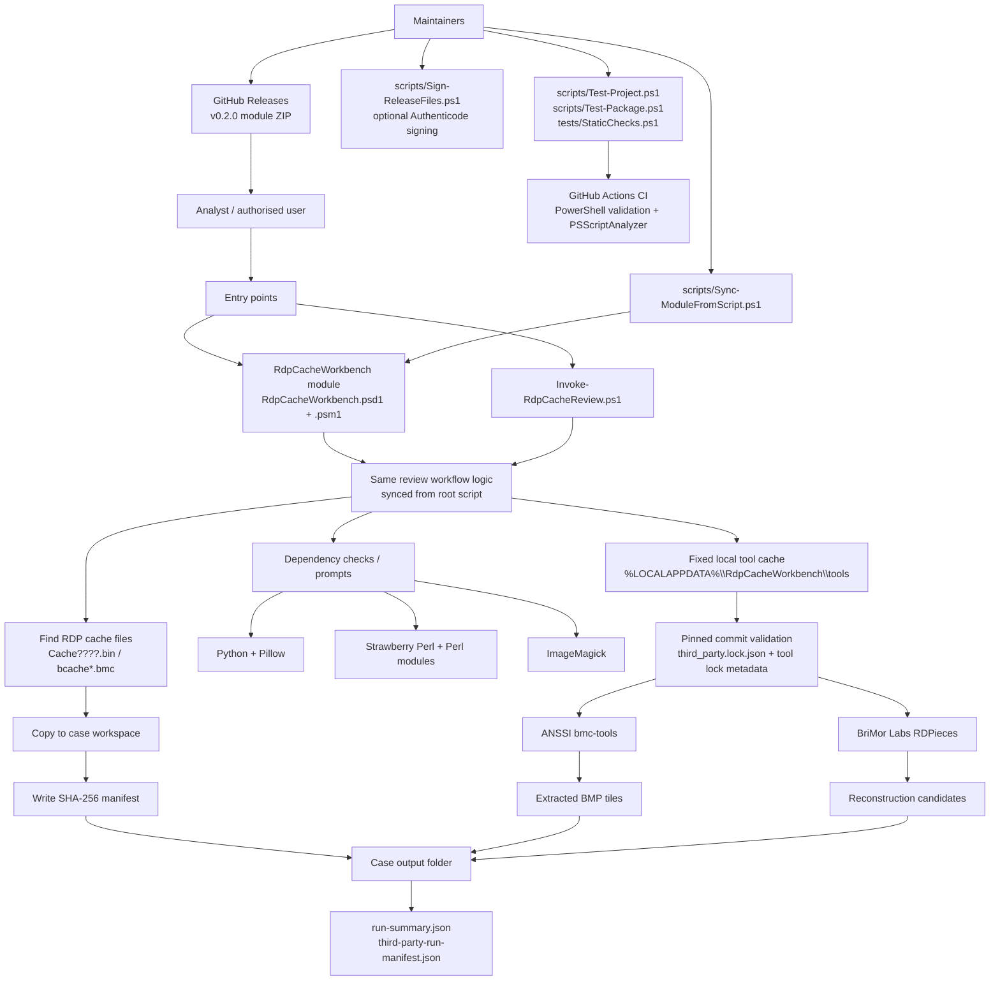

# Architecture Overview

RDP Cache Review Workbench is built as a defensive PowerShell workflow with two supported entry points:

- A direct script entry point: `Invoke-RdpCacheReview.ps1`.
- A PowerShell module package: `RdpCacheWorkbench/RdpCacheWorkbench.psd1` and `RdpCacheWorkbench/RdpCacheWorkbench.psm1`.

The module command exposes the same review workflow as the root script. Maintainers keep the two in sync with `scripts/Sync-ModuleFromScript.ps1`; that helper is not runtime tooling and is not part of the PowerShell Gallery package.

## System Diagram



## Runtime Flow

1. The user runs either `.\Invoke-RdpCacheReview.ps1` or imports the `RdpCacheWorkbench` module and runs `Invoke-RdpCacheReview`.
2. The workflow determines where to search. With `-SearchRoot`, it searches that folder broadly for cache-like filenames. Without `-SearchRoot`, it searches fixed local drives and restricts matches to the standard Terminal Server Client cache path.
3. Discovered cache files are copied into a timestamped case workspace. The script writes a SHA-256 manifest for the copied artefacts.
4. Required local dependencies are checked. Interactive runs prompt before downloads or installs; non-interactive runs require explicit switches for dependency installation.
5. Pinned helper tools are downloaded only when the local fixed tool cache is missing or stale. Cached tool folders must match lock metadata before reuse.
6. ANSSI `bmc-tools` extracts BMP tile fragments from the copied cache files.
7. BriMor Labs `rdpieces` attempts reconstruction from the extracted BMP tiles. The wrapper stages input under a temporary `subst` drive so RDPieces receives simple paths such as `R:\source` and `R:\output`.
8. The workflow writes summary and third-party run manifests alongside extracted and rebuilt output.

## Packaging And Maintenance

The root script is the primary editable implementation. The module wrapper is generated from it:

```powershell
powershell -NoProfile -ExecutionPolicy Bypass -File .\scripts\Sync-ModuleFromScript.ps1
```

Before release, maintainers should run:

```powershell
powershell -NoProfile -ExecutionPolicy Bypass -File .\scripts\Test-Project.ps1
powershell -NoProfile -ExecutionPolicy Bypass -File .\scripts\Test-Package.ps1
```

`scripts/Test-Package.ps1` stages the module under `artifacts/`, which is intentionally ignored by Git. The public module package consists only of the files in `RdpCacheWorkbench/`.

## Trust Boundaries

- Input cache files are untrusted forensic artefacts and may contain sensitive fragments.
- Extracted and rebuilt output is case material and must not be committed.
- Third-party helper tools are pinned to explicit commits and cached locally after first setup.
- RDPieces is shell-driven Perl tooling; path handling around it is intentionally constrained and should be changed only with security review.
- Authenticode signing is optional and requires a maintainer-provided code-signing certificate.
